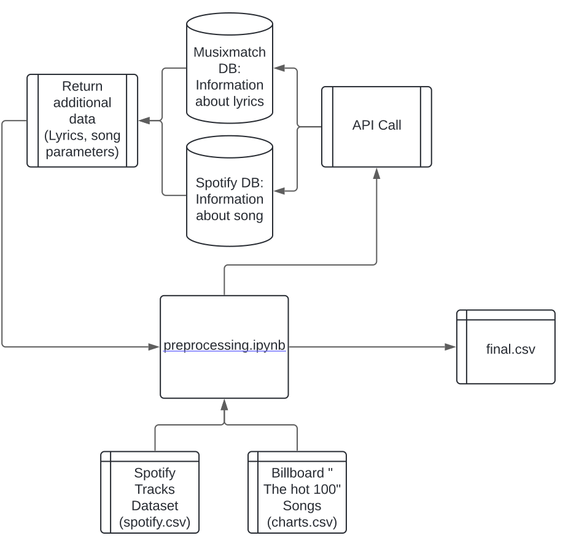
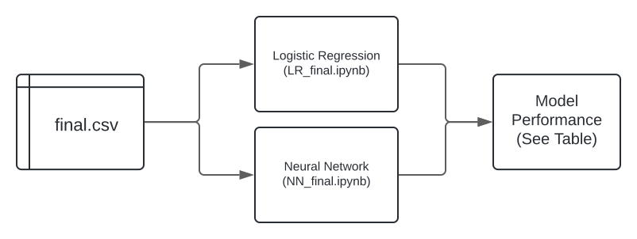
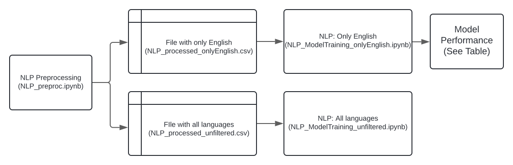

# Machine Learning to Predict the Success of Songs Based on the Billboard Hot 100

### Goal of this project 
The aim of this project is to compare the performance of different Machine Learning algorithms for predicting if a song will place on the Billboard 100. For this purpose, data on over 60.000 songs was collected using the Spotify and Lyricsmax API in addition to our two base data sets. This data was preprocessed and combined into a joint data set. 

On this data we performed a logistic regression, created a natural language processing model and a neural network. We trained the models on an evenly split data set (50% of the songs placed on the Billboard list, 50% not). The trained models were saved and benchmarked against each other. The results of this can be seen below: 

### Comparison of different models 
| Measure | Logistic Regression | Natural Language Processing | Neural Network |
|:-------------|:--------------:|--------------:|--------------:|
| areaUnderROC         | 69,15%         | 50,63%         |82,59%         |
| areaUnderPR        | 26,41%         | 49,72%         |80,65%         |
| Accuracy        | 62,46% | 71,94% | 75,18%|
| Precision | 62,73% | 66,47% | 72,72%|
| Recall | 64,40% | 92,70% | 81,86%|
| F1 Score | 63,55% | 77,42% | 77,02%|

## Preprocessing
### Data input
For the preprocessing part we used two CSV files as input, `spotify.csv` and `charts.csv`. The `spotify.csv` file contains a sample of the songs available on Spotify, additionally including metrics used by the Spotify algorithm to make song recomendations (speechiness, liveness, etc). The Charts CSV file contains the songs which were placed on the Billboard Hot 100 between 1958 and 2021. Additionaly, it provides information on the artist's name and the song's weeks on the billboard. 

## Running the preprocessing
When executing the `preprocessing.ipynb` file the input spotify.csv and charts.csv are combined, additionally the 30% of the lyrics for the songs is added via the Musixmatch API (https://developer.musixmatch.com). For the charts.csv, the Spotify metrics are added through the Spotify API (https://developer.spotify.com/documentation/web-api). The final output is the final.csv file containing a cohesive dataset of around 61.000 song entries. 

<ins>Note:</ins> Because the API calls are limited, the data was split up to perform this step. When running the preprocessing.ipynb file on the whole data the API will stop after around 2000 songs. 

### Flowchart of Pre-Processing 


# Using the models
## Loading the pretrained models
If you want to save time and not manually train the models, it is possible to load the pre-trained models. Simply copy the correct code chunks for the model you want to use into the script. All the evaluations can then be performed on the pre-trained models. However, please note that it might come to naming errors when the loaded model doesn't use the same name as the model used in the script. 
### Loading the Logistic Regression
```python
from pyspark.ml.classification import LogisticRegressionModel

model = LogisticRegressionModel.load("./trained_models/LR_model")
```
### Loading the NLP 
```python
from pyspark.ml.tuning import CrossValidatorModel

model = CrossValidatorModel.load("./trained_models/NLP_model")
```

### Loading the Neural Network
```python
from pyspark.ml.classification import MultilayerPerceptronClassificationModel

model = MultilayerPerceptronClassificationModel.load("./trained_models/NN_model")
```


## Training the models

There is a dedicated script with the training process for each model, as well as some accuracy measuremnts. 

For the Logistic Regression as well the Neural Network the process is as following: 


### Logistic Regression
Creates a Logistic Regression on the numerical features of the `final.csv` dataset. Predicts if the song places on the billboard or not. 

**Training and Evaluation**: LR_final.ipynb

### Neural Network 
Uses both numerical and text columns to make the billboard predicitons. 

**Training and Evaluation**: NN_final.ipynb

### Natural Language Processing

Uses the lyrics column to make a prediction, depending on the file it uses only English songs or all languages to make a binary prediction if the song places on the Billboard Hot 100 or not. In order to keep the models comparable we only used the model containing all the languages for our Benchmarking, as shown in the table above. 

**Preprocessing of the text**: NLP_preproc.ipynb

**Model training on all language songs**: NLP_ModelTraining_unfiltered.ipynb

**Model training on only the English songs**: NLP_ModelTraining_onlyEnglish.ipynb

The Process of Training the NLP models is outlined the following way: 



## Data used, sources
Dave, D. (2021). *Billboard “The Hot 100” Songs* [Data Set]. Kaggle. https://www.kaggle.com/ds/1211465

Pandya, M. (2022). *Spotify Tracks Dataset* [Data Set]. Kaggle. https://www.kaggle.com/dsv/4372070

### License for the data
<ins>Billboard "The Hot 100" Songs:</ins>: CC BY-NC-SA 4.0 DEED license 

<ins>Spotify Tracks Dataset:</ins> Open Database License(ODbL)v.1.0


